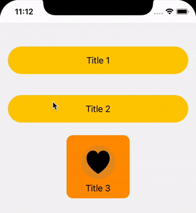

# SwiftUIRippleEffect

Cool ripple effect on you SwiftUI view.

<table>
<tr>
<td></td>
</tr>
</table>

## Features
- easy to use for regular button
- long press and gesture support

# Installing
Swift Package Manager:
```
https://github.com/Jnis/SwiftUIRippleEffect.git
```

# Usage

1) Make a shared RippleViewModel
2) Add touch handler by .addRippleTouchHandler method 
3) Add ripple view by .addRipple method

``` swift
import SwiftUIRippleEffect

var button1: some View {
    VStack {
        let rippleViewModel = RippleViewModel() // 1
        Button(action: {
            
        }, label: {
            HStack {
                Spacer()
                Text("Title 1").padding()
                Spacer()
            }
            .addRippleTouchHandler(viewModel: rippleViewModel) // 2
        })
        .buttonStyle(EmptyStyle())
        .background(
            Capsule()
                .foregroundColor(.yellow)
                .rippleEffect(color: .gray,
                              maxScale: 0.9,
                              viewModel: rippleViewModel,
                              clipShape: Capsule()) // 3
        )
    }.padding()
}
```

You can find more examples inside `/Examples` folder.

# License 
MIT
